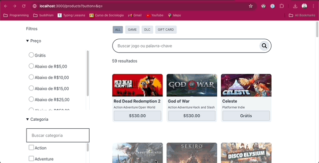

# README

## About

An example of complex searching using only Ruby On Rails 7 + Hotwire. No additional JS needed.



## Instalation

### Requirements
- ruby 3.2.3

```sh
bin/bundle
bin/rails db:setup
bin/rails db:migrate

bin/rails s
```

## Exercises

### 1. Search by product's name

- [x] Search by name, ex.: **de** should return "El**de**n Ring" but also "**De**vil May Cry"
- [x] Every new search should update the URL, ex.: "localhost:3000?**q=de**". Clicking "Back Button" on browers should go to previous query
- [x] When submitting the search, the user should not lose focus of the search bar so he can keep typing after each search◊

### 2. Search by price

- [x] Select a price from the sidebar and click APLICAR FILTROS for the filter to be applied
- [x] The applied price must show up in the URL, ex.: "localhost:3000?price=50". Clicking "Back Button" on browers should go to previous query
- [x] If I copy/paste a URL in the browser, for example: `localhost:3000?price=50` then the checkbox _Abaixo de R$50,00_ should be checked by default
- [x] If I search by a product's name and then a price, the queries should add up, example `localhost:3000?q=red&price=50`

### 3. Filter by content type

- [x] Clicking the buttons above the searchbar should apply a `&content_type[]` filter to the URL
- [x] User can select one content type at a time
- [x] Clicking a previously selected content type should remove it from the list of filters
- [x] Each selected `content_type[]` should show up on the applied filters list
- [x] If I search by a product's name, then a price and then a content type, the queries should add up, example `localhost:3000?q=red&price=50&content_type=dlc`

### 4. Search by category

- [x] Select a category from the sidebar and click APLICAR FILTROS for the filter to be applied
- [x] I should be able to filter by multiple filters at once
- [x] The applied category must show up in the URL, ex.: "localhost:3000?categories[]=action"
- [x] If I copy/paste a URL in the browser, for example: `localhost%3A3000%3Fcategories%5B%5D%3Dstrategy%26categories%5B%5D%3Dsimulation` then STRATEGY and SIMULATION categories should be selected by default

### 5. Search within categories filter

- [x] Search by pressing ENTER after typing.
- [x] A category search should NOT refresh the page.
- [x] A category search should NOT show up on the URL. There is no need for it to be shareable.
- [x] Searching by category should not remove other already applied filters.
- [ ] BONUS: Search after every keystroke. _(Requires JS)_
  - [ ] BONUS 2: Add 200ms of debounce before firing the search. _(Requires JS)_

### 6. Remove selected filters

- [x] Each selected filter should show up in a list of applied filters.
- [x] Clicking on the (X) button of an applied filter should remove it for the query and refetch the search.
- [x] Each category filter should appear as a differente item on the array of applied filters.
      Ex.: [**action (x)**] [**adventure (x)**] [**RPG (x)**]
- [x] The list of applied filters must match whatever is in the URL.
      ex.: If URL is "localhost:3000?price=10&categories[]=racing&categories[]=simulation", then the list should be loaded as [**<= R$10,00 (x)**] [**Racing (x)**] [**Simulation (x)**]

## References

- [Turbo Frames](https://turbo.hotwired.dev/reference/frames)
- [Action View Form Helpers](https://guides.rubyonrails.org/form_helpers.html)
